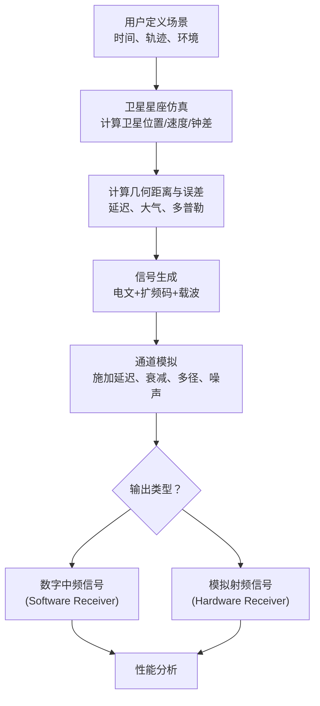

    
   <strong></strong>

<h1 align="center">
  🛰️ 📡 🖥️GNSS 信号仿真原理总述
   
  
</h1>

  
  
  
  

---

## 📖 目录

- [📖 目录](#-目录)
- [🎯 什么是 GNSS 信号仿真？](#-什么是-gnss-信号仿真)
- [🚀 为什么需要仿真？](#-为什么需要仿真)
- [🧩 仿真系统的核心组成部分](#-仿真系统的核心组成部分)
  - [1. 场景生成器 (Scenario Generator)](#1-场景生成器-scenario-generator)
  - [2. 卫星星座仿真器 (Constellation Simulator)](#2-卫星星座仿真器-constellation-simulator)
  - [3. 信号生成器 (Signal Generator)](#3-信号生成器-signal-generator)
  - [4. 通道模拟器 (Channel Simulator)](#4-通道模拟器-channel-simulator)
  - [5. 硬件在环 (Hardware-in-the-Loop)](#5-硬件在环-hardware-in-the-loop)
- [⚙️ 仿真流程总览](#️-仿真流程总览)
- [🔢 核心数学模型](#-核心数学模型)
- [🎭 仿真类型与保真度](#-仿真类型与保真度)
- [💡 应用场景](#-应用场景)
- [🔚 总结](#-总结)

---

## 🎯 什么是 GNSS 信号仿真？

**GNSS 信号仿真**是指利用计算机软件或专用硬件设备，在受控的实验室环境中，逼真地模拟和复现真实世界中全球导航卫星系统（如 GPS、北斗、Galileo、GLONASS）的射频信号传播全过程。

其核心思想是：**通过数学模型和物理效应建模，精确计算出卫星导航信号从发射机（卫星）到接收机（用户端）天线口的完整状态，并最终生成相应的数字中频（IF）或模拟射频（RF）信号。**

---

## 🚀 为什么需要仿真？

在真实外场测试 GNSS 接收机成本高昂、效率低下且不可重复。仿真解决了这一根本痛点：

*   **✅ 可控性 (Control)**：可精确、可重复地设置任何测试场景（时间、地点、轨迹、环境）。
*   **✅ 可靠性 (Reliability)**：不受真实环境（天气、电磁环境、卫星几何构型）的随机性影响。
*   **✅ 全覆盖性 (Coverage)**：能轻松模拟极端、危险或罕见场景（高速动态、强干扰、欺骗攻击、全球航线）。
*   **✅ 成本效益 (Cost-Effectiveness)**：无需组织大规模的野外实测试验，大大节省时间和经济成本。
*   **✅ 深入洞察 (Insight)**：提供完整的“地面真值”，便于对接收机性能进行根源分析。

---

## 🧩 仿真系统的核心组成部分

一个高保真的 GNSS 仿真系统通常包含以下关键模块：

### 1. 场景生成器 (Scenario Generator)
这是仿真的“剧本”，定义了所有测试条件。
*   **用户动态**：接收机的运动状态（静态、匀速、加速、高动态如导弹、特定轨迹如“8”字飞行）。
*   **时间与空间**：仿真的起始时间（用于计算卫星位置）和初始经纬高坐标。
*   **环境设置**：大气模型（电离层、对流层）、多路径环境（反射体材质、数量）、干扰与欺骗信号参数。

### 2. 卫星星座仿真器 (Constellation Simulator)
这是仿真的“天空”，负责计算所有可见卫星的状态。
*   **星历计算**：根据广播星历或精密星历，计算每一颗卫星在 WGS-84 坐标系中的精确位置和速度矢量 `(X_s, Y_s, Z_s, V_x, V_y, V_z)`。
*   **可见性判断**：根据用户位置和时间，判断哪些卫星是可见的（仰角 > 掩蔽角）。
*   **卫星钟差**：计算并应用每颗卫星的时钟误差。

### 3. 信号生成器 (Signal Generator)
这是仿真的“发射机”，负责生成干净的基带信号。
*   **导航电文**：生成符合 ICD 规范的导航数据比特流 `D(t)`。
*   **扩频调制**：生成唯一的伪随机噪声码 `C(t)`（如 GPS 的 C/A 码、P 码），并与导航电文进行模二加（相乘）。
*   **载波生成**：生成载波信号（L1, L2, L5, B1, B3 等），并植入由相对运动引起的**多普勒频移** `f_d`。
*   **调制方式**：采用 BPSK, BOC, MBOC, AltBOC 等调制方式将基带信号调制到载波上。

### 4. 通道模拟器 (Channel Simulator)
这是仿真的“传播环境”，负责对干净的信号施加各种真实世界的影响。
*   **几何延迟**：计算并模拟因传播距离不同导致的信号延迟 `τ_geom`。
*   **大气效应**：
    *   **电离层延迟**：使用 Klobuchar 等模型模拟。
    *   **对流层延迟**：使用 Hopfield 或 Saastamoinen 模型模拟。
*   **多路径效应**：模拟信号经建筑物、地面等反射后产生的延迟、衰减和相位偏移的副本信号。
*   **干扰与噪声**：
    *   **热噪声**：添加高斯白噪声 (AWGN)，模拟接收机前端噪声，用 `C/N0` (载噪比) 控制。
    *   **射频干扰**：模拟连续波 (CW)、扫频、脉冲等干扰信号。
*   **相对论效应**、**地球自转（Sagnac）效应**等。

### 5. 硬件在环 (Hardware-in-the-Loop)
*   **软件仿真**：输出数字中频 (IF) 信号，供软件接收机处理。
*   **硬件仿真**：通过 DAC 和上变频器，输出模拟射频 (RF) 信号，可直接接入真实的 GNSS 接收机天线接口进行测试。

---

## ⚙️ 仿真流程总览

以下流程图概括了从用户场景到最终信号生成的完整过程：

---

## 🔢 核心数学模型

仿真的本质是数学运算。对于每一颗卫星 `i`，接收机天线口处的信号可表示为：

$$
s_{RF}^{(i)}(t) = A_i \cdot D_i(t - \tau_i) \cdot C_i(t - \tau_i) \cdot \cos(2\pi (f_c + f_{d,i})(t - \tau_i) + \phi_0) 
$$

其中：
*   $A_i$：信号幅度（受路径损耗、天线增益影响）
*   $\tau_i$：总传播延迟 $= \frac{\rho_i}{c} + \tau_{电离层} + \tau_{对流层} + \tau_{钟差} + \ldots$
*   $f_{d,i}$：多普勒频移 $= -\frac{( \vec{V_s} - \vec{V_u} ) \cdot \vec{L} }{\lambda}$
    *   $\vec{V_s}$：卫星速度矢量
    *   $\vec{V_u}$：用户速度矢量
    *   $\vec{L}$：卫星到用户的单位方向矢量
    *   $\lambda$：载波波长

最终，接收机收到的信号是所有可见卫星信号、多路径信号、干扰和噪声的叠加：
$$
S_{RF}^{total}(t) = \sum_i s_{RF}^{(i)}(t) + \sum_j s_{MP}^{(j)}(t) + I(t) + N(t)
$$

---

## 🎭 仿真类型与保真度

| 仿真类型 | 保真度 | 输出 | 主要应用 |
| :--- | :--- | :--- | :--- |
| **软件信号仿真** | 高 | 数字中频 (IF) 信号 | 算法研发、软件接收机验证 |
| **射频矢量仿真** | 极高 | 模拟射频 (RF) 信号 | 硬件接收机集成测试、认证 |
| **数字轨道仿真** | 低 | 观测量（伪距、载波相位） | 定位解算算法测试、可行性研究 |

---

## 💡 应用场景

*   **接收机研发与测试**：从芯片到成品，验证其灵敏度、定位精度、动态性能、抗干扰能力等。
*   **高精度定位算法研究**：仿真载波相位观测值，测试 RTK、PPP 等算法的性能。
*   **抗干扰与反欺骗 (AJ/AS)**：评估接收机在复杂电磁环境下的生存能力。
*   **系统设计与验证**：评估新信号体制（如 BDS B2b、Galileo HAS）的性能。
*   **教育与培训**：提供理想的教学实验环境。

---

## 🔚 总结

**GNSS 信号仿真是连接理论设计与工程实践的桥梁。** 它通过构建一个高度可控、可重复的“数字天空”，将复杂的物理世界效应转化为可计算的数学模型，从而为 GNSS 接收机和相关技术的研发、测试与验证提供了不可或缺的强大工具。其核心价值在于 **“将不可控的野外测试转化为可控的实验室验证”**。

  用仿真预见性能，用数据驱动创新

---
